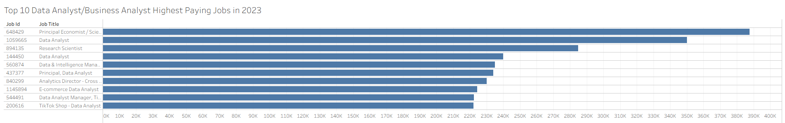
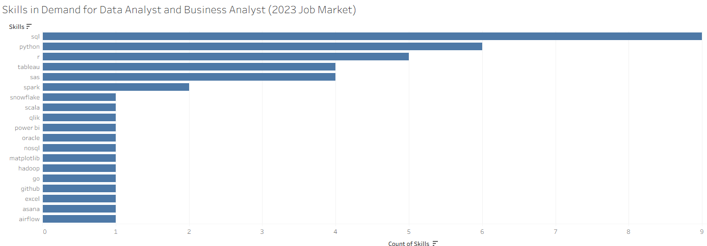

# Introduction
This project focuses on the data job market with a focus on data analyst and business analyst roles. Exploring top-paying jobs, in-demand skills, and finding the best combination of skills to learn or improve.

SQL queries? Check them out here: [sql_project](/sql_project/)
# Background
In my quest to show experince and drive I followed a [SQL Course](http://lukebarousse.com/sql) by Luke Barousse. In this course I used job market data from 2023 that he accquired and ran many queries to showcase top-paid and in-demand skills for the roles of data analyst or business analyst.

The data used in the sql course contains many different insights on job titles, salaries, locations, and core skills.

### The questions that were investigated through SQL queries were:
1. What are the top-paying data analyst jobs?
2. What skills are required for these top-paying jobs?
3. What skills are most in demand for data analysts?
4. Which skills are associated with higher salaries?
5. What are the most optimal skills to learn?
# Tools I Used
For this project I used serveral key tools such as:
- **SQL:** The main driver of my analysis, allowing me to run many quieres in search of the questions mentioned above. 
- **PostgreSQL:** The chosen database management system and my very first time learning and using it to complete a project. 
- **Visual Studio Code:** My prefered database management and executing SQL queries or running any C# or C++ and in the near future python code. 
- **Git & GitHub:** First time learing and using git/github as this is an esstienal tool for version control and sharing my SQL scripts and analysis, ensuring collaboration and project tracking. 
# The Analysis
The queries in this project were developed to investigate key aspects of the data anayst job market. Here's an overview of my approach to each one. 
### 1. Top Paying Data Analyst Jobs/Business Analyst. 
The goal of this query is to identify the highest-paying roles, I filtered data analyst and business analyst positions by average yearly salary and location, focusing on jobs located in the area of Long Beach and Los Angeles. This query highlights the high paying opportunities in their respected fields. 

```sql
SELECT
    job_id,
    job_title,
    job_location,
    job_schedule_type,
    salary_year_avg,
    job_posted_date,
    company_dim.name AS company_name
FROM
     job_postings_fact
LEFT JOIN company_dim ON job_postings_fact.company_id = company_dim.company_id     
WHERE
 job_title_short IN ('Data Analyst', 'Business Analyst') AND
    (
        job_location IN ('Long Beach, CA','Los Angeles, CA') OR
        job_location LIKE '%, CA'
    )AND
    salary_year_avg IS NOT NULL
ORDER BY
    salary_year_avg DESC
LIMIT 10
```
Here is a breakdown of the top data analyst/business analyst jobs in 2023.
- **Wide Salary Range:** Top 10 paying data analyst/business analyst roles span from $222,000 to $387,000 indicating significant salary potential in their respected field.
- **Diverse Employers:** Companies like Roblox, Anthropic, and TikTok are among those offering high salaries, displaying a wide range of potential interest across different industries.
- **Job Title Variety:** There's a high diversity in job titles, from Data Analyst to Data & Intelligence Manager, Finance. Reflecting a wide range of potential roles.

 *Bar graph visualizing the salary for the top 10 salaries for data analysts/business analysts; I used Tableau to generate this graph from the SQL query results*

### 2. Skills for Top Paying jobs
To understand what skills are required for the top-paying jobs, I joined the job postings with the skills data, providing insight into what employers value for high-compensation roles.
```sql
WITH top_paying_jobs AS (
    SELECT
        job_id,
        job_title,
        salary_year_avg,
        company_dim.name AS company_name
    FROM
        job_postings_fact
    LEFT JOIN company_dim ON job_postings_fact.company_id = company_dim.company_id     
    WHERE
        job_title_short IN ('Data Analyst', 'Business Analyst') AND
    (
        job_location IN ('Long Beach, CA','Los Angeles, CA') OR
        job_location LIKE '%, CA'
    )AND
    salary_year_avg IS NOT NULL
    ORDER BY
        salary_year_avg DESC
    LIMIT 10        
)

SELECT
top_paying_jobs.*,
skills_dim.skills
FROM
    top_paying_jobs
INNER JOIN skills_job_dim ON top_paying_jobs.job_id = skills_job_dim.job_id
INNER JOIN skills_dim ON skills_job_dim.skill_id = skills_dim.skill_id
ORDER BY
    salary_year_avg DESC 
```
Here's the breakdown of the most demanded skills for the top 10 highest paying data analyst/business analyst jobs in 2023.

- **SQL** is leading in demand with 9 counts.
- **Python** is second with a count of 6.
- **R** follows closely with a count of 5. Other skills like **Tableau**, **SAS**, **Spark** and **Snowflake** show varying degrees of demand.

*Bar graph visualizing the count of skills for the top 10 paying jobs for data/bussiness analysts; I used Tableau to create this bar graph from the query results.*

### 3. In-Demand Skills for Data Analysts
This query helped identify the skills most frequently requested in job postings, directing focus to areas with high demand.
```sql
SELECT 
skills,
COUNT(skills_job_dim.job_id) AS demand_count
FROM
    job_postings_fact
INNER JOIN skills_job_dim ON job_postings_fact.job_id = skills_job_dim.job_id
INNER JOIN skills_dim ON skills_job_dim.skill_id = skills_dim.skill_id
WHERE
    job_title_short IN ('Data Analyst', 'Business Analyst') AND
    (
        job_location IN ('Long Beach, CA','Los Angeles, CA') OR
        job_location LIKE '%, CA'
    ) 
GROUP BY
    skills
ORDER BY
    demand_count DESC
LIMIT 5
```
Here's a breakdown of the most demanded skills for data analysts/business analysts in 2023
- **SQL** and **Excel** remain fundamental, emphasizing the need for strong foundational skills in data processing and spreadsheet mainpulation.
- **Programming** and **Visualization Tools** like **Python**, **Tableau**, and **R** are essential, pointing towrads the increasing importance of technical skills in data stroytelling and decision support.

| Skill   | Demand Count |
|---------|-------------|
| SQL     | 5,610       |
| Excel   | 4,115       |
| Tableau | 3,648       |
| Python  | 3,225       |
| R       | 2,006       |

*Table of the demand for the top 5 skills in data analyst/busines analyst job postings*

### 4. Skills Based on Salary
Exploring the average salaries associated with different skills revealed which skills are the highest paying.
```sql
SELECT 
skills,
ROUND(AVG(salary_year_avg), 2) AS avg_salary
FROM
    job_postings_fact
INNER JOIN skills_job_dim ON job_postings_fact.job_id = skills_job_dim.job_id
INNER JOIN skills_dim ON skills_job_dim.skill_id = skills_dim.skill_id
WHERE
    job_title_short IN ('Data Analyst', 'Business Analyst') AND
    (
        job_location IN ('Long Beach, CA','Los Angeles, CA') OR
        job_location LIKE '%, CA'
    ) AND
    salary_year_avg IS NOT NULL
GROUP BY
    skills
ORDER BY
    avg_salary DESC
LIMIT 25
```
Here's a breakdown of the results for top paying skills for Data Analysts/Business Analysts:

- **High Demand for Big Data & ML Skills** Top salaries are driven by analysts skilled in big data technologies like Scala, machince learning tools (MXnet,Keras), reflecting the industry's high valuation of data processing and predictive modeling capabilities. 

- **Software Development & Deployment Proficiency** Knowledge in development and depolyment tools (Node, Bash,Ansible,Pubbpet), leading to a repeating pattern of having a hybrid skills set of data anlaysis and engineering. 

- **Could Computing Expertise** 
Experience with distributed and cloud-based databases tools (Cassandra,DynamoDB),
indicating the increasely importance of those who can design and manage could-driven architechtures are highly value and ofter earn higher salaries.

| Skill     | Avg Salary |
|-----------|-----------:|
| asana     | 235000.00  |
| scala     | 204666.67  |
| mxnet     | 198000.00  |
| node      | 180000.00  |
| keras     | 174040.00  |
| cassandra | 168694.83  |
| dynamodb  | 165000.00  |
| bash      | 159640.00  |
| ansible   | 159640.00  |
| puppet    | 159640.00  |

*Table of the average salary for the top 10 paying skills for data analysts/business analysts*

### 5. Most Optimal Skills to Learn
Combining insights from demand and salary data, this query aimed to showcase skills that are high in demand and are often related to high salaries, offering a strategic focus for skill development. 

```sql
WITH skills_demand AS (
    SELECT 
    skills_dim.skill_id,
    skills_dim.skills,
    COUNT(skills_job_dim.job_id) AS demand_count
    FROM
        job_postings_fact
    INNER JOIN skills_job_dim ON job_postings_fact.job_id = skills_job_dim.job_id
    INNER JOIN skills_dim ON skills_job_dim.skill_id = skills_dim.skill_id
    WHERE
        job_title_short IN ('Data Analyst', 'Business Analyst') AND
        (
            job_location IN ('Long Beach, CA','Los Angeles, CA') OR
            job_location LIKE '%, CA'
        ) 
    GROUP BY
        skills_dim.skill_id

), average_salary AS (
    SELECT 
    skills_job_dim.skill_id,
    ROUND(AVG(salary_year_avg), 2) AS avg_salary
    FROM
        job_postings_fact
    INNER JOIN skills_job_dim ON job_postings_fact.job_id = skills_job_dim.job_id
    INNER JOIN skills_dim ON skills_job_dim.skill_id = skills_dim.skill_id
    WHERE
        job_title_short IN ('Data Analyst', 'Business Analyst') AND
        (
            job_location IN ('Long Beach, CA','Los Angeles, CA') OR
            job_location LIKE '%, CA'
        ) AND
        salary_year_avg IS NOT NULL
    GROUP BY
    skills_job_dim.skill_id
)

SELECT
    skills_demand.skill_id,
    skills_demand.skills,
    demand_count,
    avg_salary
FROM
    skills_demand
INNER JOIN average_salary ON skills_demand.skill_id = average_salary.skill_id    
WHERE
    demand_count > 10
ORDER BY
    avg_salary DESC,
    demand_count DESC
LIMIT 25
```
| Skill ID | Skill     | Demand Count | Avg Salary  |
|----------|-----------|-------------:|-----------:|
| 237      | asana     | 20           | 235000.00  |
| 3        | scala     | 83           | 204666.67  |
| 63       | cassandra | 19           | 168694.83  |
| 12       | bash      | 27           | 159640.00  |
| 18       | mongodb   | 19           | 159574.33  |
| 92       | spark     | 281          | 158747.48  |
| 97       | hadoop    | 280          | 158077.63  |
| 31       | perl      | 90           | 146861.50  |
| 25       | php       | 71           | 145161.50  |

*Table of the most optimal skills for data analyst/business analyst sorted by salary.*

Here's a breakdown of the most optimal skills for Data Analysts/Business Analysts in 2023:

- **High-Paying Specialized Tools:** Skills such as Asana, Scala, and Cassandra stand out with excedendlly high salaries, reaching up to $235,000 for Asana and over $200,000 for Scala. However, the realtive low demand count (19 to 83) implies these are niche or specialized skill sets and are in limited supply therefore giving their high compensation. 

- **Big Data Technologies in High Demand:** Hadoop and Spark high demand count (281 and 280 respectively) in addtion to thier strong average salaries ($158,000). Indicates the continued importance of big data processing frameworks, where professionals who can handle large-scale data systems are highly sought after. 

- **Scripting and Backend Technologies:** Bash, Perl, and PHP showcases moderate demand (27 to 90) with strong average salaries ranging from ~ $145,000 to ~ $160,000. These skills highlight the demand for backend scripting, automation, and legacy system maintenance.

- **Database and NoSQL Technologies:** MongoDB is indicating constant demand and high average salaries around $159,574, reflecting the growing demand on NoSQL databases for handling unstructured and scalabe data. 
# What I learned 
Throughout this journey, I've significantly strengthened my SQL skill set with advanced techniques
# Conclusion
